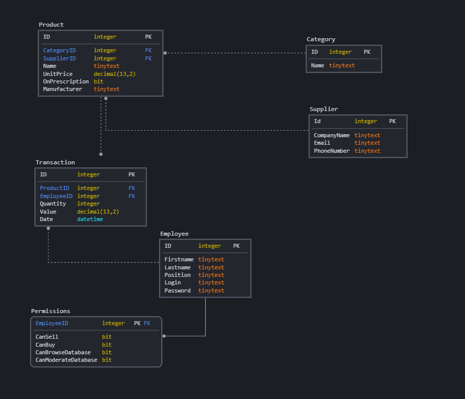
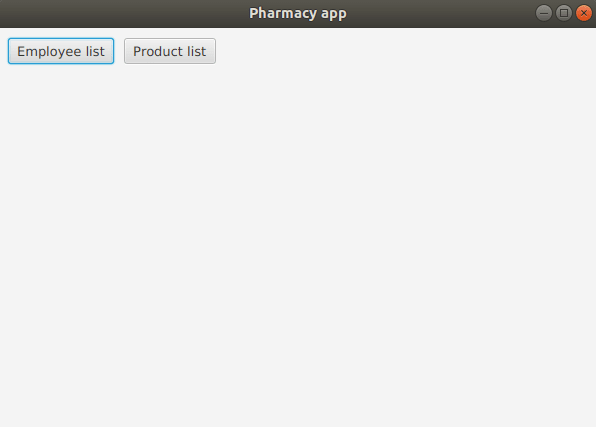
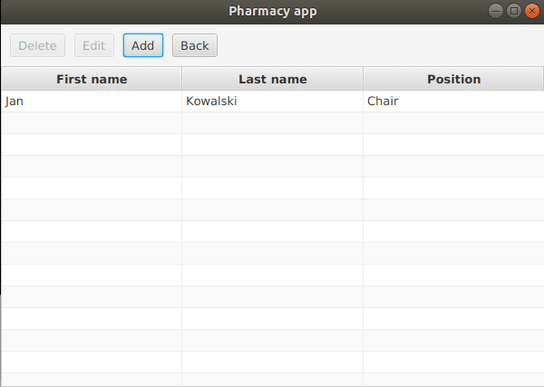

# Pharmacy App
### Grupa: Paweł Kopel, Konrad Przewłoka, Marek Ślązak, Magdalena Badura


#### **Milestone 1 (stan na 01.12.2020)** 
- model danych
- integracja z bazą danych (Hibernate)
- GUI pozwalające na dodawanie, edytowanie i usuwanie pracowników oraz produktów

## Opis
Aplikacja do zarządzania apteką. 

## Technologie
* Java 14, Gradle
* Hibernate

## Uruchamianie aplikacji
Do uruchomienia aplikacji potrzebny jest program Gradle i Java 14.

Uruchomienie aplikacji - wywołanie komendy w katalogu głównym:
* Linux:
```
./gradlew run
```

* Windows:
```
gradlew.bat run
```


## Model bazy danych



Product zawiera:
* ID - identyfikator (Primary Key)
* CategoryID - identyfikator kategorii produktu (Foreign Key)
* SupplierID - identyfikator dostawcy (Foreign Key)
* Name - nazwa produktu
* UnitPrice - cena produktu
* OnPrescription - flaga mówiąca o tym, czy lek jest na receptę
* Manufacturer - nazwa producenta

Category zawiera:
* ID - identyfikator (Primary Key)
* Name - nazwa kategorii

Supplier zawiera:
* ID - identyfikator (Primary Key)
* CompanyName - nazwa firmy
* Email - email do komunikacji z firmą
* PhoneNumber - numer telefonu do komunikacji z firmą

Transaction zawiera:
* ID - identyfikator (Primary Key)
* ProductID - identyfikator kupowanego produktu (Foreign Key)
* EmployeeID - identyfikator pracownika nadzorującego transakcję (Foreign Key)
* Quantity - ilość kupowanych produktów
* Value - cena do zapłaty
* Date - data wykonania transakcji

Employee zawiera:
* ID - identyfikator (Primary Key oraz Foreign Key)
* Firstname - imię
* Lastname - nazwisko
* Position - pozycja w firmie: Manager, Chair lub Worker
* Login - będzie wykorzystywany przy autentykacji
* Password - będzie wykorzystywane przy autentykacji

Permissions zawiera:
* EmployeeID - identyfikator (Primary Key)
* CanSell - pozwolenie na sprzedawanie leków
* CanBuy - pozwolenie na kupowanie leków
* CanBrowseDatabase - pozwolenie na przeglądanie bazy danych
* CanModerateDatabase - pozwolenie na modyfikację bazy danych


## Przewodnik po projekcie
[Data Access Object](./src/main/java/wt/muppety/dao)

[Model](./src/main/java/wt/muppety/model) - klasy Category, Employee, MockData, Product, Supplier, Transaction - w obecnym stanie w każdej klasie znajduje się konstruktor oraz gettery i settery poszczególnych atrybutów.

GUI zgodne ze wzorcem model-view-presenter:

* [Controller](./src/main/java/wt/muppety/controller)
* [Presenter](./src/main/java/wt/muppety/presenter)
* [View](./src/main/java/wt/muppety/view)


## Aplikacja

Po uruchomieniu aplikacji mamy opcję przejścia do listy pracowników lub do listy produktów:



Po przejściu do Employee list mamy widok na listę pracowników z danymi: imię, nazwisko i pozycja. Mamy opcję dodania pracownika oraz usunięcia/edytowania wpisu z listy. 
Po wybraniu opcji Add uruchamia się okno Add user z polami z klasy Employee do wypełnienia. Po wybraniu opcji Edit uruchamia się okno Edit user z polami wstępnie wypełnionymi. Po kliknięciu na konkretny wpis na liście aktywuje się opcja Delete i wpis jest usuwany z listy.
 Widok po dodaniu jednego pracownika:



Po przejściu do Product list mamy widok na listę produktów z danymi: nazwa, cena, kategoria, wytwórca oraz informacja, czy lek jest na receptę. Mamy opcję dodania produktu, dodania kategorii oraz usunięcia/edytowania wpisu z listy. Opcje - analogiczne jak w Employee list. Widok dodawania produktu:


