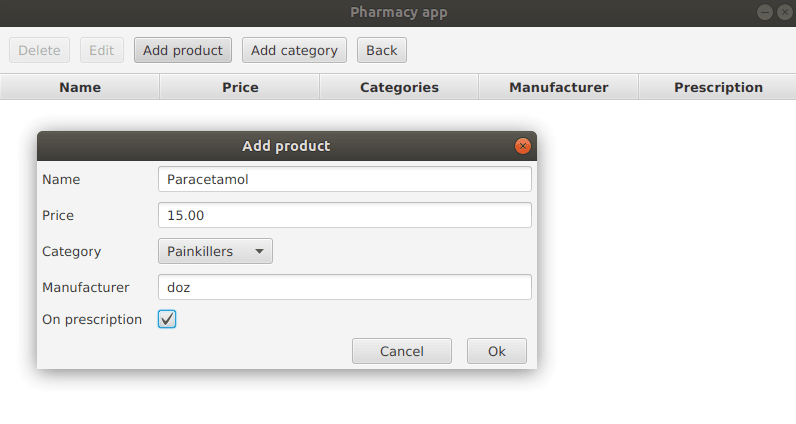

# Pharmacy App
### Grupa: Paweł Kopel, Konrad Przewłoka, Marek Ślązak, Magdalena Badura


#### **Milestone 1 (stan na 01.12.2020)** 
- model danych
- plany integracji z bazą danych (Hibernate, SQLite)
- GUI pozwalające na dodawanie, edytowanie i usuwanie pracowników i produktów oraz dodawanie kategorii produktów


#### **Milestone 2 (stan na 15.12.2020)**
- autentykacja
- integracja z bazą danych (Hibernate, SQLite)
- GUI pozwalające na dodawanie transakcji, dostawców

## Opis
Aplikacja wspomagająca zarządzanie apteką. Aplikacja umożliwia pracownikom zarządzanie produktami 
dostępnymi w aptece, zawieranymi transakcjami, jak i również listą pracowników.  

## Technologie
* Java 14, Gradle
* Hibernate
* SQLite

## Uruchamianie aplikacji
Do uruchomienia aplikacji potrzebny jest program Gradle i Java 14.

Uruchomienie aplikacji - wywołanie komendy w katalogu głównym:
* Linux:
```
./gradlew run
```

* Windows:
```
gradlew.bat run
```


## Przewodnik po projekcie

#### [Model](docs/model/README.md)

#### [Persystencja](docs/persistence/README.md)

#### [Autentykacja](docs/authentication/README.md)

#### [GUI](docs/gui/README.md)

W projekcie wykorzystano wzorce projektowe:
* model-view-presenter [(GUI)](docs/gui/README.md)
* singleton [(autentykacja)](docs/authentication/README.md)
* DAO i ORM [(persystencja)](docs/persistence/README.md)


## Aplikacja

Po uruchomieniu aplikacji otwiera się okno logowania:


Po przejściu do Employee list mamy widok na listę pracowników z danymi: imię, nazwisko i pozycja. Mamy opcję dodania pracownika oraz usunięcia/edytowania wpisu z listy. 
Po wybraniu opcji Add uruchamia się okno Add user z polami z klasy Employee do wypełnienia. Po wybraniu opcji Edit uruchamia się okno Edit user z polami wstępnie wypełnionymi. Po kliknięciu na konkretny wpis na liście aktywuje się opcja Delete i wpis jest usuwany z listy.
 Widok po dodaniu jednego pracownika:


Po przejściu do Product list mamy widok na listę produktów z danymi: nazwa, cena, kategoria, wytwórca oraz informacja, czy lek jest na receptę. Mamy opcję dodania produktu, dodania kategorii oraz usunięcia/edytowania wpisu z listy. Opcje - analogiczne jak w Employee list. Widok dodawania produktu:


