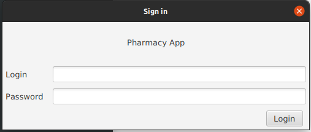
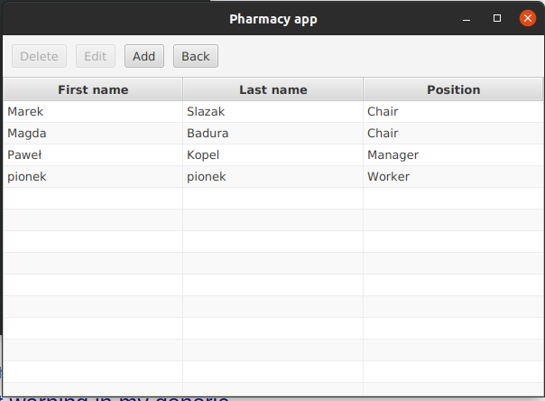
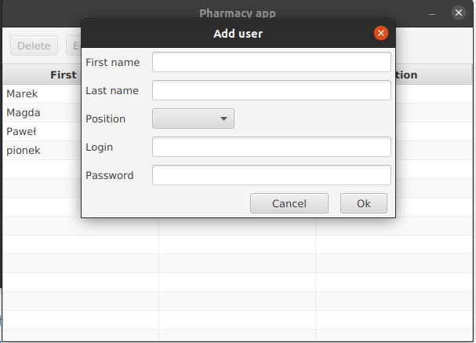
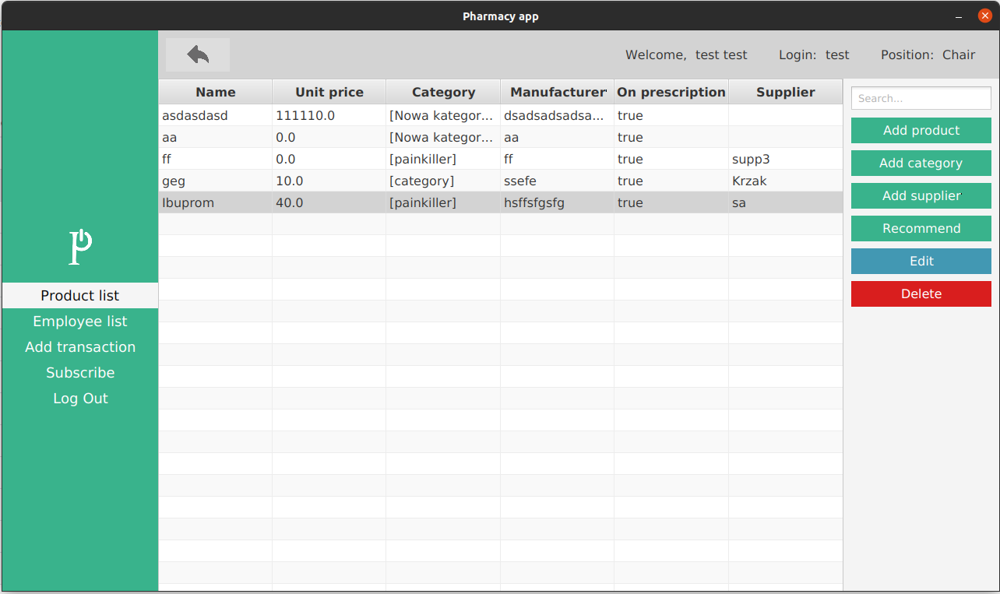
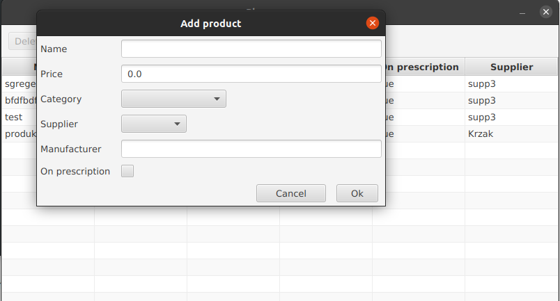
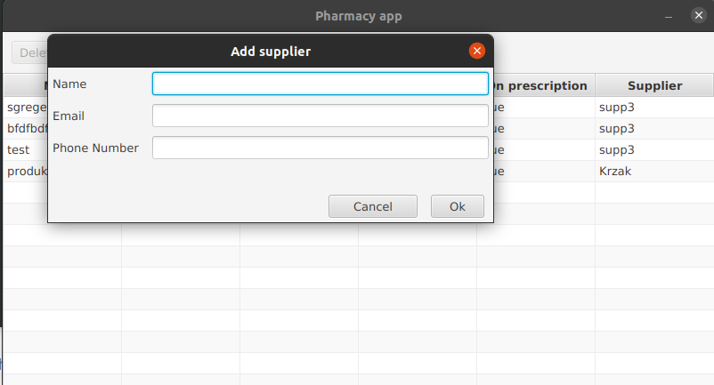
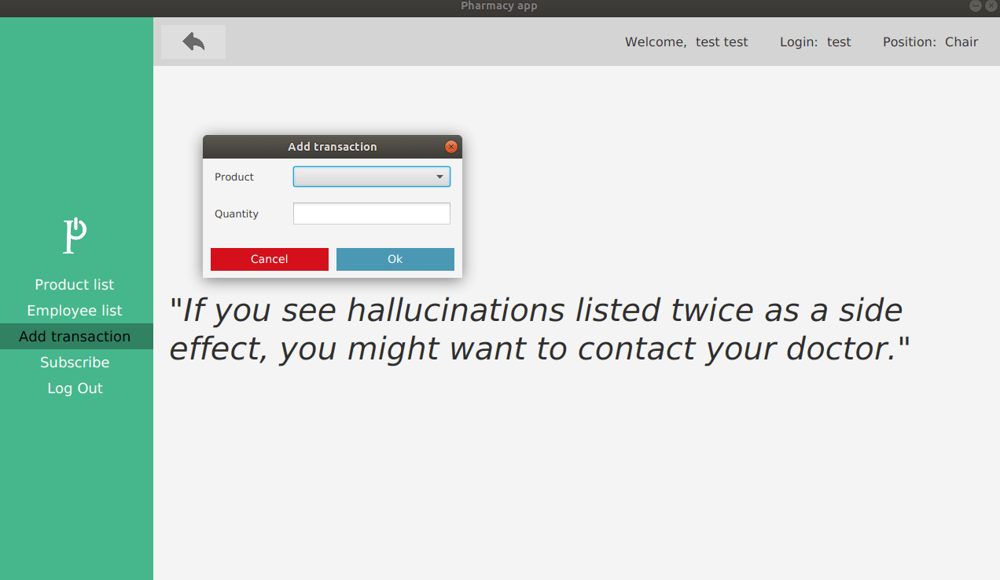

# Pharmacy App

### Grupa: Paweł Kopel, Konrad Przewłoka, Marek Ślązak, Magdalena Badura

#### **Milestone 1 (stan na 01.12.2020)**

- model danych
- plany integracji z bazą danych (Hibernate, SQLite)
- GUI pozwalające na dodawanie, edytowanie i usuwanie pracowników i produktów oraz dodawanie kategorii produktów

#### **Milestone 2 (stan na 15.12.2020)**

- autentykacja
- integracja z bazą danych (Hibernate, SQLite)
- GUI pozwalające na dodawanie transakcji, dostawców

## Opis

Aplikacja wspomagająca zarządzanie apteką. Aplikacja umożliwia pracownikom zarządzanie produktami dostępnymi w aptece,
zawieranymi transakcjami, jak i również listą pracowników.

## Technologie

* Java 14, Gradle
* Hibernate
* SQLite

## Uruchamianie aplikacji

Do uruchomienia aplikacji potrzebny jest program Gradle i Java 14.

Uruchomienie aplikacji — wywołanie komendy w katalogu głównym:

* Linux:

```
./gradlew run
```

* Windows:

```
gradlew.bat run
```

## Przewodnik po projekcie

#### [Model](docs/model/README.md)

#### [Persystencja](docs/persistence/README.md)

#### [Autentykacja](docs/authentication/README.md)

#### [GUI](docs/gui/README.md)

W projekcie wykorzystano wzorce projektowe:

* model-view-presenter [(GUI)](docs/gui/README.md)
* singleton [(autentykacja)](docs/authentication/README.md)
* DAO i ORM [(persystencja)](docs/persistence/README.md)

## Aplikacja

Po uruchomieniu aplikacji otwiera się okno logowania:



Do logowania trzeba wykorzystać dane użytkownika znajdującego się już w bazie, np. login 'user' hasło 'user'.

Po przejściu do Employee list otwiera się widok na listę pracowników z danymi: imię, nazwisko i pozycja. Mamy opcję
dodania pracownika oraz usunięcia/edytowania wpisu z listy.



Po wybraniu opcji Add uruchamia się okno Add user z polami z klasy Employee do wypełnienia. Po wybraniu opcji Edit
uruchamia się okno Edit user z polami wstępnie wypełnionymi. Po wybraniu konkretnego wpisu na liście aktywuje się opcja
Delete i wpis jest usuwany z listy. Widok po dodaniu jednego pracownika:



Po przejściu do Product list otwiera się widok na listę produktów z danymi: nazwa, cena, kategoria, wytwórca,
informacja, czy lek jest na receptę oraz dostawca. Mamy opcję dodania/usunięcia/edytowania produktu, dodania kategorii
oraz dodania dostawcy do listy.



Widok dodawania produktu:



Widok dodawania dostawcy:



Trzecią opcją w głównym oknie jest dodanie nowej transakcji:



Zamknięcie okna nowej transakcji powoduje otwarcie widoku listy produktów.
