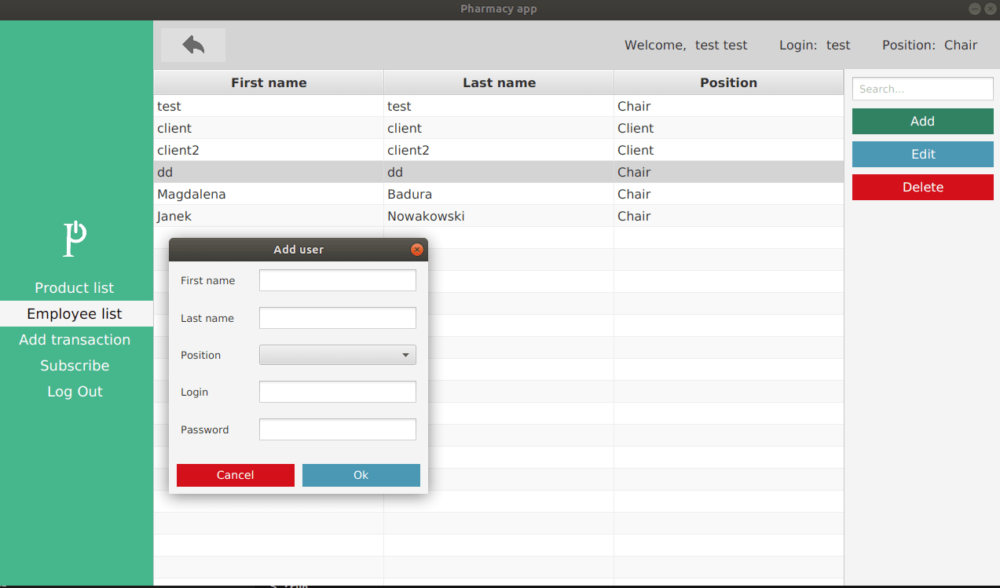
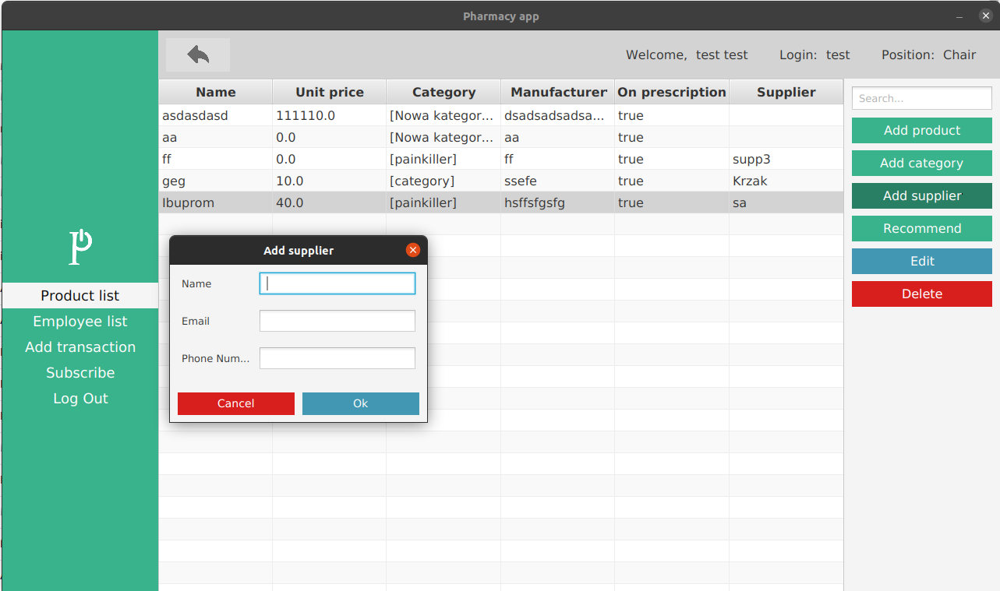

# Pharmacy App

### Grupa: Paweł Kopel, Konrad Przewłoka, Marek Ślązak, Magdalena Badura

#### **Milestone 1 (stan na 01.12.2020)**

- model danych
- plany integracji z bazą danych (Hibernate, SQLite)
- GUI pozwalające na dodawanie, edytowanie i usuwanie pracowników i produktów oraz dodawanie kategorii produktów

#### **Milestone 2 (stan na 15.12.2020)**

- autentykacja
- integracja z bazą danych (Hibernate, SQLite)
- GUI pozwalające na dodawanie transakcji, dostawców

#### **Milestone 3 (stan na 12.01.2021)**

- dodanie opcji subskrypcji i wysyłania notyfikacji przez maila
- dodanie opcji wysyłania rekomendacji 
- dodanie sortowania i wyszukiwania w listach pracowników i produktów
- poprawienie opcji wybrania wielu kategorii przy dodawaniu/edycji produktu
- ulepszone GUI
- rozróżnienie widoku klienta i pracownika
- haszowanie haseł użytkowników w bazie danych

## Opis

Aplikacja wspomagająca zarządzanie apteką. Aplikacja umożliwia pracownikom zarządzanie produktami dostępnymi w aptece, zawieranymi transakcjami, jak i również listą pracowników.

## Technologie

* Java 14, Gradle
* Hibernate
* SQLite

## Uruchamianie aplikacji

Do uruchomienia aplikacji potrzebny jest program Gradle i Java 14.

Uruchomienie aplikacji — wywołanie komendy w katalogu głównym:

* Linux:

```
./gradlew run
```

* Windows:

```
gradlew.bat run
```

## Przewodnik po projekcie

#### [Model](docs/model/README.md)

#### [Persystencja](docs/persistence/README.md)

#### [Autentykacja](docs/authentication/README.md)

#### [GUI](docs/gui/README.md)

#### [Powiadomienia](docs/notificator/README.md)

W projekcie wykorzystano wzorce projektowe:

* Model-View-Presenter ([GUI](docs/gui/README.md))
* Singleton ([autentykacja](docs/authentication/README.md) i [powiadomienia](docs/notificator/README.md))
* DAO i ORM ([persystencja](docs/persistence/README.md))

## Aplikacja

**Aby zalogować się jako pracownik, należy wpisać**:
**login: test**
**password: test**

Po uruchomieniu aplikacji otwiera się okno logowania/rejestracji:


Po wybraniu opcji Register otwiera się okno rejestracji:


Widok strony głównej aplikacji przy zalogowanym pracowniku:


Widok listy pracowników wraz z oknem dodawania pracownika przy zalogowanym pracowniku:



Widok listy produktów wraz z oknem dodawania dostawcy przy zalogowanym pracowniku:



Widok strony głównej wraz z oknem dodawania transakcji przy zalogowanym pracowniku:


Widok strony głównej przy zalogowanym kliencie z aktywowaną subskrypcją:


Widok listy produktów posortowanych według kategorii przy zalogowanym kliencie:


Widok listy produktów przy użyciu opcji szukania po nazwie przy zalogowanym kliencie:


