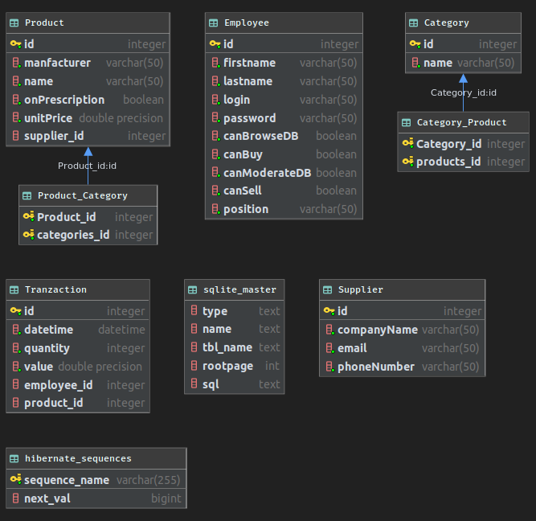

## Pakiet [`wt.muppety.dao`](../../src/main/java/wt/muppety/dao)

### Lista klas:

* [`BaseDao`](../../src/main/java/wt/muppety/dao/BaseDao.java)
* [`CategoryDao`](../../src/main/java/wt/muppety/dao/CategoryDao.java)
* [`EmployeeDao`](../../src/main/java/wt/muppety/dao/EmployeeDao.java)
* [`ProductDao`](../../src/main/java/wt/muppety/dao/ProductDao.java)
* [`SupplierDao`](../../src/main/java/wt/muppety/dao/SupplierDao.java)
* [`TransactionDao`](../../src/main/java/wt/muppety/dao/TransactionDao.java)

#### Klasa [`BaseDao`](../../src/main/java/wt/muppety/dao/BaseDao.java)

Bazowa klasa implementująca logikę dostępu do obiektów w bazie danych. Pozwala na wykonywanie operacji zapisu,
listowania, aktualizacji i usuwania wpisów w bazie aplikacji.

#### Klasa [`CategoryDao`](../../src/main/java/wt/muppety/dao/CategoryDao.java)

Klasa dziedzicząca po klasie [`BaseDao`](../../src/main/java/wt/muppety/dao/BaseDao.java), specjalizowana w obsłudze
operacji na obiektach typu [`Category`](../model/README.md). Dodatkowo do operacji dziedziczonych z
[`BaseDao`](../../src/main/java/wt/muppety/dao/BaseDao.java) umożliwia wyszukiwanie kategorii za pomocą nazwy.

#### Klasa [`EmployeeDao`](../../src/main/java/wt/muppety/dao/EmployeeDao.java)

Klasa dziedzicząca po klasie [`BaseDao`](../../src/main/java/wt/muppety/dao/BaseDao.java), specjalizowana w obsłudze
operacji na obiektach typu [`Employee`](../model/README.md). Dodatkowo do operacji dziedziczonych z
[`BaseDao`](../../src/main/java/wt/muppety/dao/BaseDao.java) umożliwia wyszukiwanie kategorii za pomocą loginu.

#### Klasa `ProductDao`

Klasa dziedzicząca po klasie [`BaseDao`](../../src/main/java/wt/muppety/dao/BaseDao.java), specjalizowana w obsłudze
operacji na obiektach typu [`Product`](../model/README.md).

#### Klasa [`SupplierDao`](../../src/main/java/wt/muppety/dao/SupplierDao.java)

Klasa dziedzicząca po klasie [`BaseDao`](../../src/main/java/wt/muppety/dao/BaseDao.java), specjalizowana w obsłudze
operacji na obiektach typu [`Supplier`](../model/README.md).

#### Klasa  [`TransactionDao`](../../src/main/java/wt/muppety/dao/TransactionDao.java)

Klasa dziedzicząca po klasie [`BaseDao`](../../src/main/java/wt/muppety/dao/BaseDao.java), specjalizowana w obsłudze
operacji na obiektach typu [`Transaction`](../model/README.md).

## Pakiet [`wt.muppety.session`](../../src/main/java/wt/muppety/session)

#### Klasa [`SessionService`](../../src/main/java/wt/muppety/session/SessionService.java)

Klasa [`SessionService`](../../src/main/java/wt/muppety/session/SessionService.java) tworzy i dostarcza obiektom DAO
obiekt `Session` potrzebny do interakcji z bazą danych.

## Hibernate

Do zarządzania bazą danych wykorzystano [Hibernate](https://hibernate.org) i
[SQLite](https://www.sqlite.org/index.html) na podstawie przykładu z laboratorium.

### Model bazy danych

